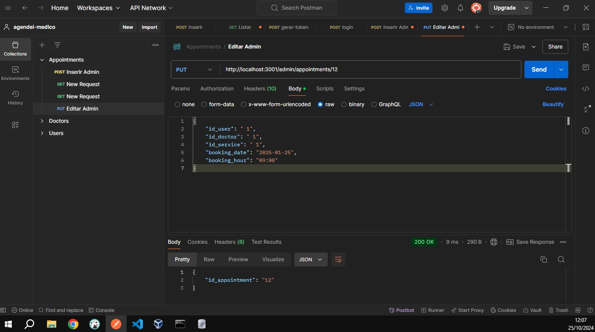
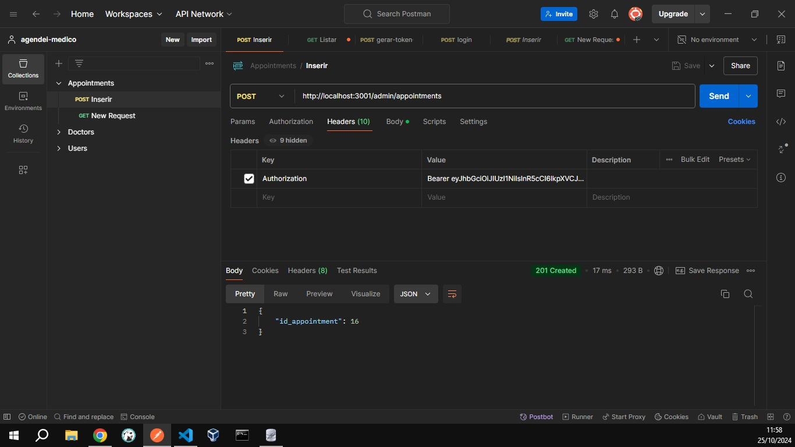
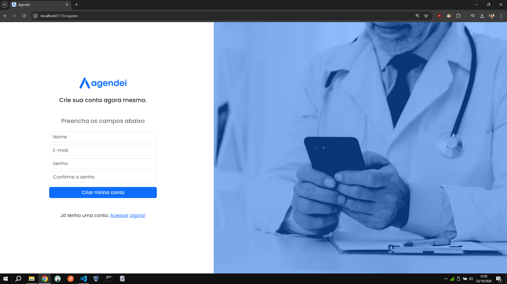
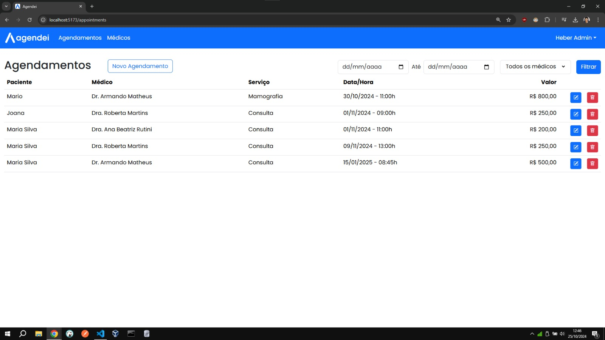

# Agendei - Aplicação para Agendamento Médico

Agendei é uma aplicação completa para agendamento de consultas médicas, permitindo a interação entre pacientes e médicos de forma simples e eficiente. Este projeto é dividido em três partes: Agendei API, Agendei Mobile e Agendei Web.

## Imagens da aplicação e estrutura do Projeto

### Postman

    
    

### Telas da aplicação: 

    
    

### Agendei API

A pasta `agendei-api` contém a implementação da API RESTful:

- **controllers**: Controladores para gerenciar a lógica de cada recurso (médicos, usuários e agendamentos).
- **database**: Contém o banco de dados SQLite (`banco.db`) e a configuração da conexão.
- **repositories**: Camada responsável pela interação com o banco de dados.
- **services**: Serviços que contêm a lógica de negócio relacionada a médicos, usuários e agendamentos.
- **routes.js**: Define as rotas da API, utilizando o Express.
- **token.js**: Middleware para validação de tokens JWT.

### Agendei Mobile

A pasta `agendei-mobile` é o aplicativo móvel desenvolvido com Expo Go:

- **assets**: Recursos estáticos (imagens, fontes, etc.).
- **components**: Componentes reutilizáveis da interface.
- **constants**: Constantes utilizadas em todo o aplicativo.
- **contexts**: Contextos para gerenciamento de estado com React Context API.
- **routes**: Gerenciamento de rotas do aplicativo.
- **screens**: Telas do aplicativo.

### Agendei Web

A pasta `agendei-web` é a interface web da aplicação. A estrutura inclui:

- **assets**: Recursos estáticos.
- **components**: Componentes reutilizáveis da interface.
- **constants**: Constantes utilizadas na aplicação.
- **pages**: Páginas do aplicativo.
- **styles**: Estilos CSS.
- **main.jsx**: Ponto de entrada do aplicativo web.
- **routes.jsx**: Gerenciamento de rotas da aplicação web.

## Rotas da API

E o mais desafiador, as rotas disponíveis na API:

### Médicos
- `GET /doctors`: Lista todos os médicos (requer token).
- `POST /doctors`: Adiciona um novo médico (requer token).
- `PUT /doctors/:id_doctor`: Edita um médico existente (requer token).
- `DELETE /doctors/:id_doctor`: Exclui um médico (requer token).
- `GET /doctors/:id_doctor/services`: Lista serviços de um médico específico (requer token).

### Usuários
- `POST /users/register`: Registra um novo usuário.
- `POST /users/login`: Realiza login de um usuário.
- `GET /users/profile`: Obtém o perfil do usuário logado (requer token).

### Agendamentos
- `GET /appointments`: Lista agendamentos do usuário logado (requer token).
- `POST /appointments`: Cria um novo agendamento (requer token).
- `DELETE /appointments/:id_appointment`: Exclui um agendamento (requer token).

### Admin
- `POST /admin/register`: Registra um novo administrador.
- `POST /admin/login`: Realiza login de um administrador.
- `GET /admin/appointments`: Lista todos os agendamentos (requer token).
- `GET /admin/users`: Lista todos os usuários (requer token).
- `GET /admin/appointments/:id_appointment`: Obtém detalhes de um agendamento específico (requer token).
- `POST /admin/appointments`: Cria um novo agendamento (requer token).
- `PUT /admin/appointments/:id_appointment`: Edita um agendamento existente (requer token).

### Minhas Reflexões

O desenvolvimento da aplicação Agendei foi uma experiência incrivelmente enriquecedora, que não só ampliou meus conhecimentos técnicos, mas também me proporcionou uma compreensão mais profunda sobre a importância de soluções na área da saúde. Ao longo deste projeto, mergulhei em diversas tecnologias e práticas de desenvolvimento que se mostraram cruciais para a criação de um sistema com boa usabilidade e eficiente.

**Aprendizados Técnicos**

**Arquitetura de Software**: A estrutura modular da aplicação, dividida em API, mobile e web, me ensinou a importância de uma boa arquitetura. Isso facilitou o desenvolvimento colaborativo e a manutenção do código, permitindo que cada equipe focasse em suas respectivas áreas sem interferências.

**Desenvolvimento de APIs RESTful**: Trabalhar com o Express para construir rotas e gerenciar requisições foi gratificante, criando endpoints seguros e eficientes, implementando validações e gerenciando autenticações usando JWT. A construção de uma API que é tanto escalável quanto segura é uma habilidade que considero essencial.

**Interface do Usuário**: A interação com ferramentas de design e bibliotecas como React Native me permitiu criar uma experiência visualmente agradável e funcional, essencial para um aplicativo que lida com informações sensíveis como agendamentos médicos.

**Gerenciamento de Banco de Dados**: O uso de SQLite como banco de dados para armazenar dados críticos da aplicação foi uma experiência interessante. Me divirto estruturando e gerenciando dados de forma eficiente, além de realizar operações CRUD com uma camada de repositório que separa a lógica de acesso a dados da lógica de negócios.

**Teste e Validação**: A implementação de testes com ferramentas como Postman para garantir que cada endpoint da API funcionasse conforme o esperado foi um aprendizado valioso. A importância dos testes na detecção precoce de bugs e na garantia de um produto de alta qualidade ficou clara durante o processo de desenvolvimento.

O Agendei não é apenas uma aplicação de agendamento médico; é um reflexo do que podemos alcançar quando unimos tecnologia, design e compreensão das necessidades humanas.

